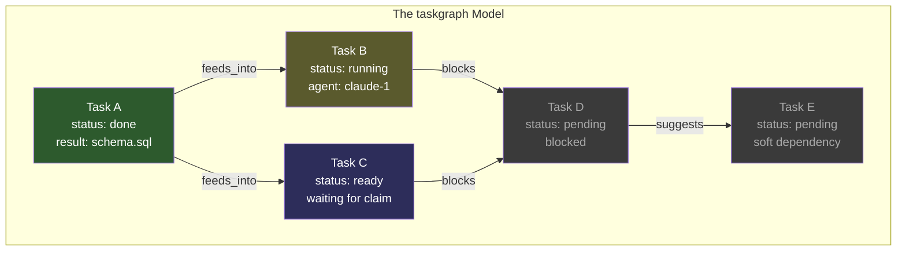
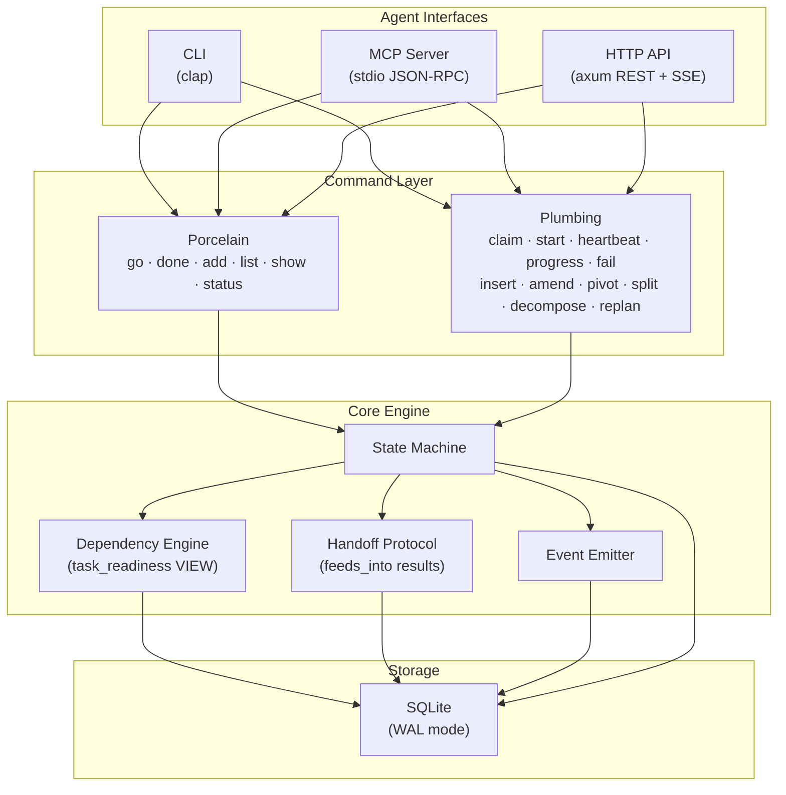
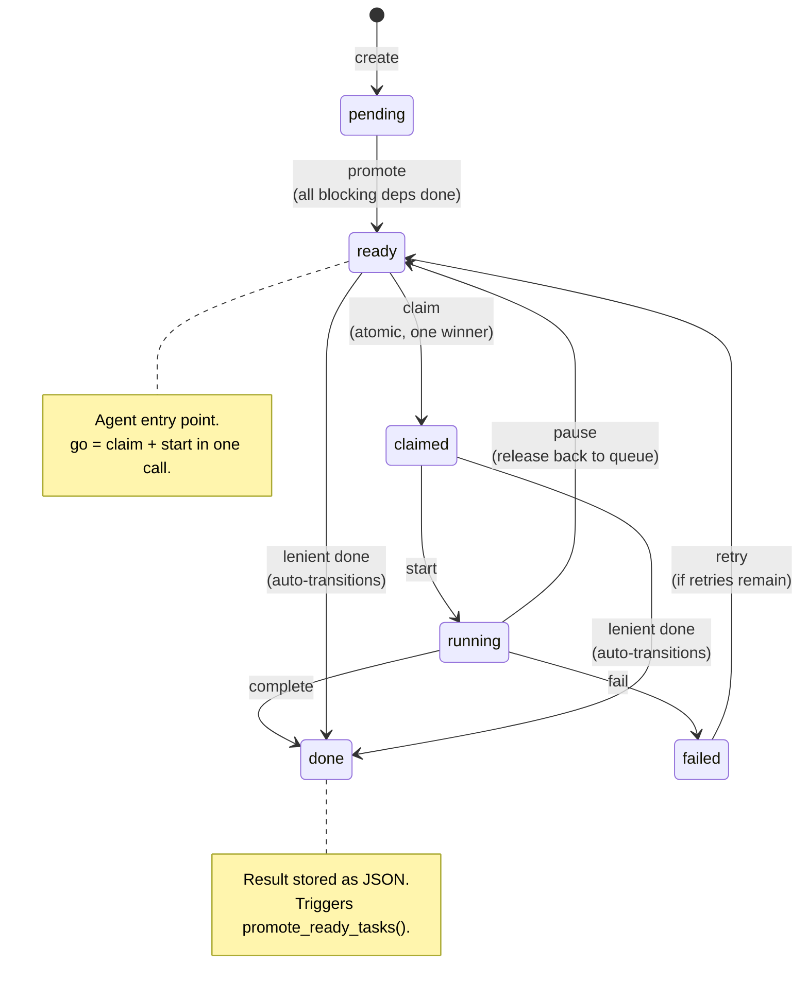
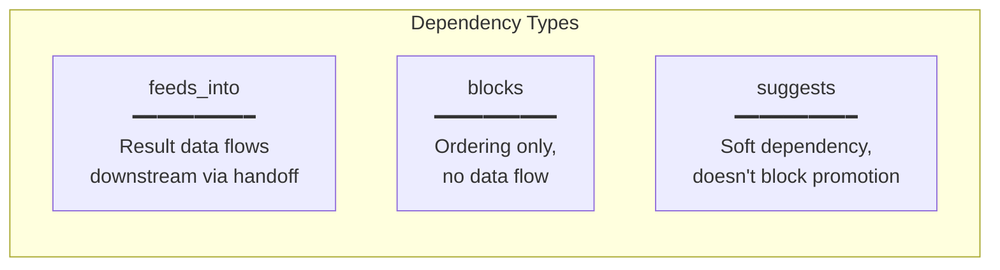
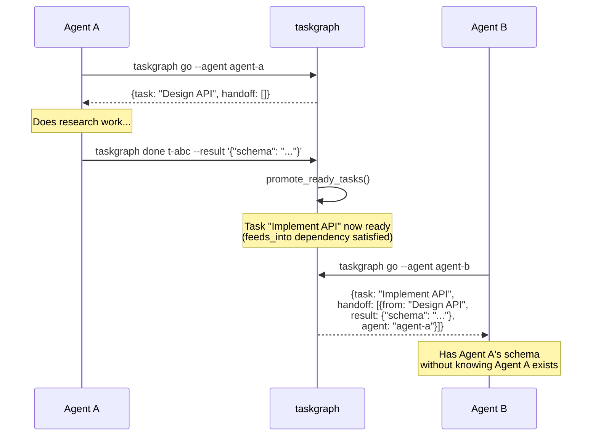
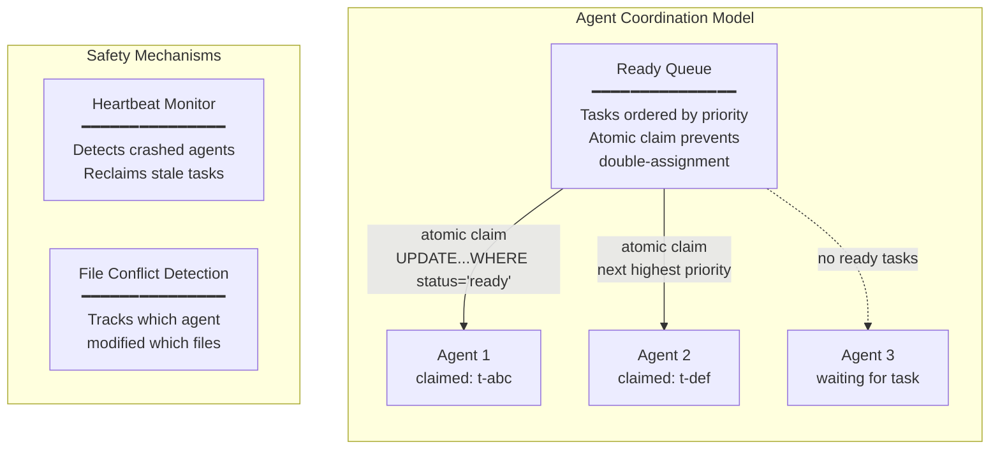
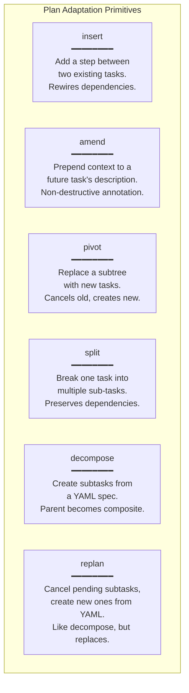
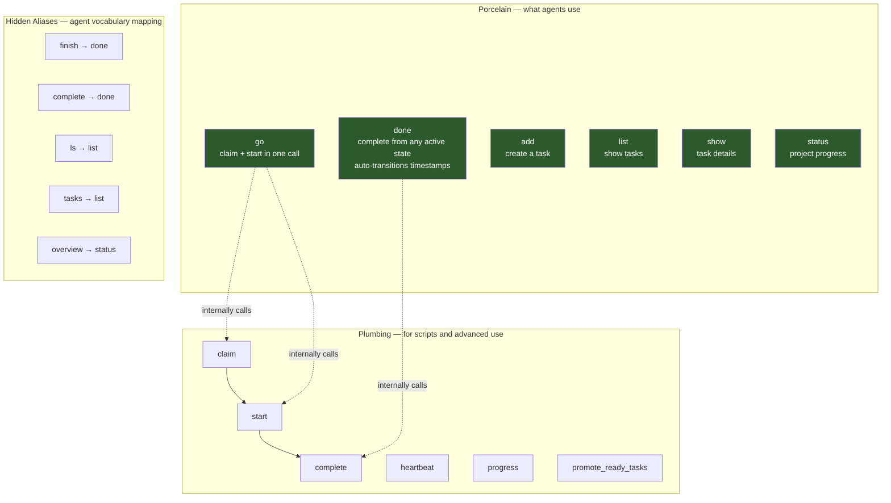
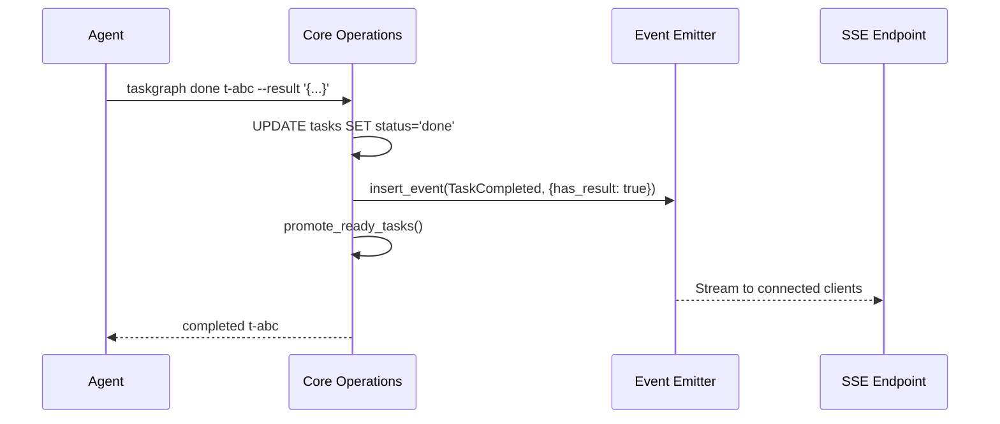
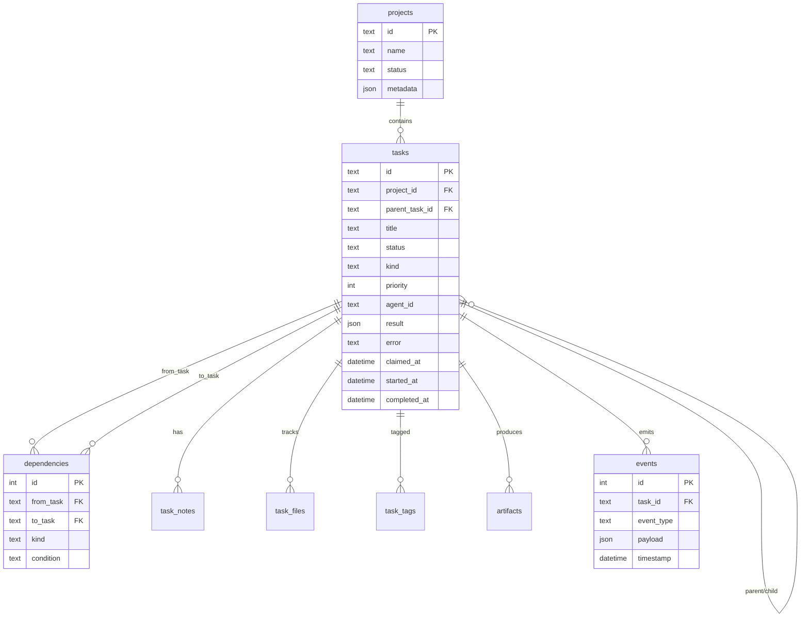

# taskgraph Architecture

> SQLite for Agents — a zero-config, embedded task graph primitive for AI agent orchestration.

## Why taskgraph Exists

Every AI agent framework today solves orchestration by adding infrastructure: message queues, workflow engines, state machines-as-a-service, vector databases. More services to deploy, more endpoints to configure, more things to break at 3am.

taskgraph takes the opposite approach. The same way SQLite eliminated the need to run a database server for most applications, taskgraph eliminates the need to run an orchestration server for most agent workloads. It's a single binary that creates a `.taskgraph.db` file. That file *is* the entire coordination layer — the task graph, the dependency engine, the work queue, the handoff protocol, and the audit log.

No daemon. No config. No network. Just a file.

---

## Core Insight: Tasks Are the Universal Primitive

When an AI agent works, it does exactly three things:

1. **Decides** what to do next
2. **Does** the work
3. **Reports** what happened

Every orchestration framework models this differently — some use state machines, some use message passing, some use function calls. taskgraph models it as a **directed acyclic graph of tasks with typed dependency edges**, and makes that graph the single source of truth for all coordination.



This is not a workflow engine. It's a **coordination primitive** — the smallest possible abstraction that lets multiple agents work together on a shared plan without stepping on each other.

---

## Architecture Overview



### Three Interfaces, One Truth

taskgraph exposes the same task graph through three interfaces — **CLI**, **MCP** (Model Context Protocol), and **HTTP** — all backed by the same SQLite file. An agent can create tasks via CLI, another can claim them via MCP, and a dashboard can monitor via HTTP SSE. They all see the same state because they all read from the same `.taskgraph.db`.

This is a deliberate architectural choice. Most orchestration systems treat the API server as the source of truth and the database as an implementation detail. In taskgraph, the **file is the truth**. The interfaces are just lenses into it. You can copy the file to another machine, open it with `sqlite3`, query it directly, back it up with `cp`. No export/import, no API migration, no schema versioning ceremony.

---

## The Task State Machine



### Why These States

**`pending` vs `ready`**: This is the core of taskgraph's dependency engine. A task stays `pending` until *all* its blocking dependencies (`blocks`, `feeds_into`) are in `done` or `done_partial` state. The `task_readiness` SQL VIEW computes this atomically, and `promote_ready_tasks()` does a single bulk UPDATE. This means you never poll for readiness — completion of one task automatically unlocks the next.

**`claimed` vs `running`**: In multi-agent scenarios, claiming a task is a separate concern from starting work on it. The claim is an atomic SQL UPDATE with `WHERE status = 'ready'` — SQLite guarantees only one agent wins. This is optimistic locking without a lock table.

**Lenient transitions**: After real-world testing showed agents wasting 83% of session time fighting the state machine, we added lenient transitions. `done` now accepts tasks in `ready`, `claimed`, or `running` status, auto-filling timestamps. This means a single-agent workflow is `go` → `done` (2 commands), while multi-agent safety is preserved because the claim mechanism still prevents double-assignment.

---

## The Dependency Engine



### How Readiness Is Computed

taskgraph uses a SQL VIEW — `task_readiness` — to determine which tasks should be promoted from `pending` to `ready`:

```sql
CREATE VIEW task_readiness AS
SELECT
  t.id, t.status,
  COUNT(CASE
    WHEN d.kind IN ('blocks', 'feeds_into')
     AND upstream.status NOT IN ('done', 'done_partial')
    THEN 1
  END) AS unmet_deps,
  CASE
    WHEN t.status = 'pending'
     AND [unmet_deps] = 0
    THEN 1 ELSE 0
  END AS promotable
FROM tasks t
LEFT JOIN dependencies d ON d.to_task = t.id
LEFT JOIN tasks upstream ON upstream.id = d.from_task
GROUP BY t.id;
```

This is evaluated atomically by SQLite. When any task completes, `promote_ready_tasks()` runs:

```sql
UPDATE tasks SET status = 'ready'
WHERE id IN (SELECT id FROM task_readiness WHERE promotable = 1);
```

One query. All newly-unblocked tasks promoted in a single transaction. No event propagation, no message passing, no eventual consistency. The graph structure *is* the scheduling algorithm.

### Why Not a Trigger?

We evaluated using SQLite triggers (auto-promote on every UPDATE to `done`). The VIEW approach was chosen because:

1. **Batch efficiency**: Multiple tasks may complete in rapid succession. The VIEW evaluates all of them at once.
2. **Predictable timing**: Callers control when promotion happens (always after `complete_task`), making the behavior easier to reason about.
3. **No cascading trigger storms**: Deep dependency chains don't create recursive trigger execution.

---

## The Handoff Protocol

This is taskgraph's answer to "how do agents pass data to each other?"



When Agent B calls `go`, the `go_payload()` function automatically includes the results from all upstream `feeds_into` dependencies. Agent B receives the schema that Agent A produced, without either agent needing to know about the other. The graph structure creates the data flow.

### Why JSON Results Instead of Files?

Files are paths. Paths are machine-specific. A result like `{"schema": "users(id INT, name TEXT)"}` is portable, inspectable, and small enough to include in the handoff context. For large artifacts (binary files, datasets), taskgraph has a separate `artifacts` table — but the handoff protocol carries structured results, not file pointers.

---

## Multi-Agent Coordination



### Atomic Claim — The Core Primitive

The `claim_next_task` operation is a single SQL statement:

```sql
UPDATE tasks
SET status = 'claimed', agent_id = ?1, claimed_at = ?2
WHERE id = (
  SELECT id FROM tasks
  WHERE project_id = ?2 AND status = 'ready'
  ORDER BY priority DESC, created_at ASC
  LIMIT 1
)
RETURNING ...;
```

SQLite serializes writes at the statement level. Two agents executing this simultaneously — even from different threads — are guaranteed to claim different tasks. No advisory locks, no Redis SETNX, no distributed consensus. The database *is* the lock manager.

### Heartbeat and Recovery

Each agent periodically calls `taskgraph task heartbeat <id>` to prove it's alive. A background sweeper checks for tasks whose `last_heartbeat` exceeds the `heartbeat_interval`:

- If retries remain: reset to `ready` (another agent can claim it)
- If retries exhausted: mark `failed`
- If the task is composite: roll up child task status

This handles the crash scenario — an agent dies mid-task, and the work is automatically returned to the queue.

---

## Plan Adaptation (Mid-Flight Changes)

Real-world agent work is messy. The initial plan is always wrong. taskgraph provides six primitives for changing the plan while tasks are in flight:



### Why These Six?

They map to the six things that go wrong during agent execution:

| What goes wrong | Primitive | Example |
|---|---|---|
| Missed a step | `insert` | "Need to add validation between parse and save" |
| New information surfaced | `amend` | "The API requires OAuth, not API keys" |
| Approach was wrong | `pivot` | "REST won't work, switch to GraphQL" |
| Task is too big | `split` | "Break 'implement auth' into login, signup, forgot-password" |
| Need to plan subtasks | `decompose` | "Here's the YAML spec for all the test cases" |
| Subtasks were wrong | `replan` | "Throw out the test plan, here's the new one" |

### What-If Analysis

Before making destructive changes, agents can preview effects:

```
taskgraph what-if cancel t-abc
```

This returns which tasks would be cancelled, which would be stranded (no remaining dependencies), and whether any running work would be affected — without actually changing anything. It uses a snapshot-and-simulate approach: snapshot current task statuses, apply the mutation in-memory, diff the results.

---

## The Porcelain/Plumbing Split

Inspired by git's architecture, taskgraph separates high-level agent-facing commands (porcelain) from low-level precise-control commands (plumbing):



### Why This Matters for AI Agents

AI agents don't read documentation. They read `--help` output and try commands. In testing, a Gemini Flash agent tried `taskgraph list`, `taskgraph ls`, `taskgraph tasks`, `taskgraph show`, `taskgraph add`, `taskgraph update`, `taskgraph start`, `taskgraph plan`, `taskgraph track`, and `taskgraph version` — all before finding `taskgraph task create`.

taskgraph now accepts all of these. The hidden aliases and `infer_subcommands` mean that agents can use whatever vocabulary feels natural — `taskgraph fin`, `taskgraph comp`, `taskgraph ta` — and taskgraph routes to the right handler. The agent doesn't know these are aliases. It just works.

---

## Event System



Events are emitted as **side-effects** of core operations, not as the source of truth. This is a deliberate choice against event sourcing:

- **State is always queryable**: `SELECT * FROM tasks WHERE status = 'ready'` — no event replay needed
- **Events are optional**: If event emission fails, the primary operation still succeeds (`let _ =` in Rust)
- **Events are for observability**: Dashboards, logs, SSE streams for monitoring — not for deriving state

The event types map directly to lifecycle transitions: `task_created`, `task_ready`, `task_claimed`, `task_started`, `task_completed`, `task_failed`, `task_cancelled`.

---

## Storage Design



### Why SQLite, Not Postgres

| Concern | SQLite | Postgres |
|---|---|---|
| Setup | `taskgraph project create "x"` — done | Install, configure, create user, create db, connection string |
| Portability | Copy `.taskgraph.db` to any machine | pg_dump, transfer, pg_restore |
| Concurrency | Serialized writes (fine for <100 agents) | Full MVCC (needed for 1000+ agents) |
| Deployment | Single binary, no runtime | Requires running service |
| Inspection | `sqlite3 .taskgraph.db` | psql + connection params |
| Backup | `cp .taskgraph.db .taskgraph.db.bak` | pg_dump or continuous archiving |

taskgraph's target is **1 to ~50 agents working on a shared plan**. At this scale, SQLite's serialized writer model is not a bottleneck — write transactions are sub-millisecond. The readability and portability advantages dominate.

### WAL Mode

taskgraph enables Write-Ahead Logging (`PRAGMA journal_mode = WAL`), which allows concurrent readers during writes. Multiple agents can read task state while one agent is completing a task. The write serialization only affects concurrent writes, which the atomic claim mechanism already handles.

---

## Design Decisions and Trade-offs

### IDs: Short, Fuzzy-Matched

Task IDs are 8-character prefixes of ULIDs (e.g., `t-a1b2c3d4`). Short enough for agents to type, unique enough to avoid collisions in any realistic project. taskgraph uses Levenshtein distance matching for typos — `t-a1b2c3d5` will find `t-a1b2c3d4` if it's the closest match.

### JSON Result, Not Typed Schema

Task results are untyped JSON (`result JSON` in the schema). This is intentional — taskgraph doesn't know what agents produce. A research task might return `{"findings": [...]}`, a code task might return `{"files_modified": [...]}`. Imposing a schema would force agents to serialize their diverse outputs into a common format, adding friction without value. The `feeds_into` handoff protocol passes whatever JSON was stored.

### No Workflow Language

taskgraph has no DSL, no YAML workflow definitions, no visual graph builder. The task graph is constructed imperatively through commands: `taskgraph task create`, `taskgraph task add-dep`. This is because AI agents don't write YAML — they call commands. The graph emerges from the agent's decisions, not from a pre-defined template.

The exception is `decompose` and `replan`, which accept YAML for bulk subtask creation. This is a convenience for the "I have a plan, create all the tasks" use case, not a workflow definition language.

### Agent-Agnostic

taskgraph has no concept of agent capabilities, routing rules, or agent selection. Any agent can claim any ready task. This is intentional — routing logic belongs in the agent framework, not in the coordination primitive. taskgraph answers "what needs to be done?" and "who's doing what?", not "who should do what?".

---

## Performance Characteristics

| Operation | Complexity | Typical Latency |
|---|---|---|
| Create task | O(1) | < 1ms |
| Claim next task | O(log n) | < 1ms (index scan) |
| Complete task + promote | O(n) | < 5ms (n = total tasks, VIEW evaluation) |
| List tasks (filtered) | O(n) | < 10ms for 1000 tasks |
| What-if analysis | O(n + e) | < 50ms (n = tasks, e = edges) |
| Lookahead (2 layers) | O(n) | < 10ms |

The `task_readiness` VIEW is the most expensive operation, as it joins `tasks × dependencies × upstream_tasks`. For projects with < 5,000 tasks (which covers virtually all agent workloads), this is sub-50ms. Beyond that, materializing the view with triggers would be the optimization path.

---

## What Makes This Different

**From workflow engines** (Temporal, Airflow, Prefect): taskgraph is not a service. There's no scheduler process, no worker fleet, no dashboard server. The "scheduler" is a SQL VIEW. The "workers" are agents that call `taskgraph go`. The "dashboard" is `taskgraph status`.

**From message queues** (RabbitMQ, SQS, Redis Streams): taskgraph is not fire-and-forget. Tasks have dependencies, results, and state. A completed task unlocks downstream tasks automatically. You can inspect the entire graph at any point — not just the current queue depth.

**From agent frameworks** (LangGraph, CrewAI, AutoGen): taskgraph is not an agent framework. It doesn't run agents, doesn't manage prompts, doesn't chain LLM calls. It's the coordination layer that any framework can use. An agent built with LangGraph and an agent built with raw API calls can both coordinate through the same `.taskgraph.db` file.

**From databases** (SQLite itself, Redis, MongoDB): taskgraph is not a general-purpose database. It's a domain-specific database for one thing: task coordination. The schema, the state machine, the dependency engine, and the claim mechanism are all built-in. You don't write SQL — you call `taskgraph go`.

The closest analogy is **SQLite itself**. SQLite didn't compete with Oracle — it created a new category (embedded database) by making the radical simplification that most applications don't need a server. taskgraph makes the same bet for agent orchestration: most agent workloads don't need a service. They need a file.
